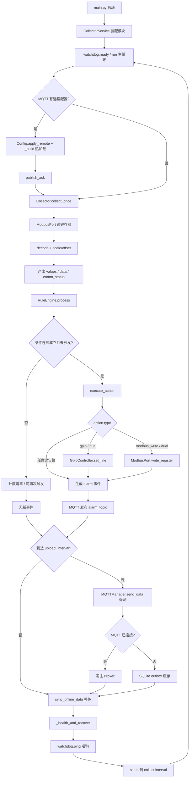
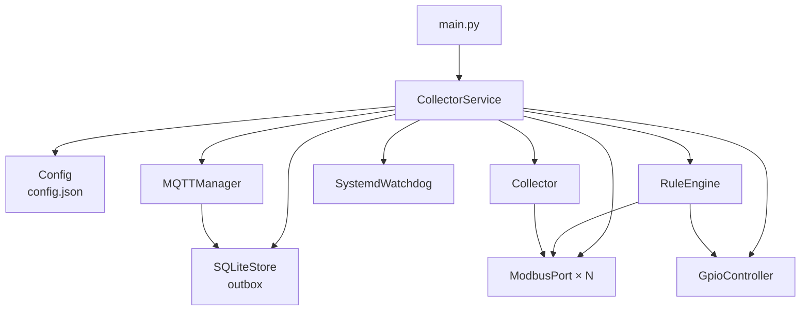
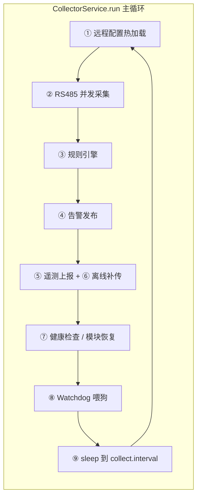
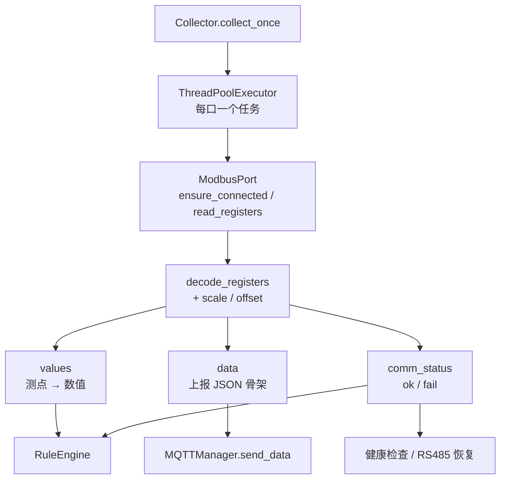
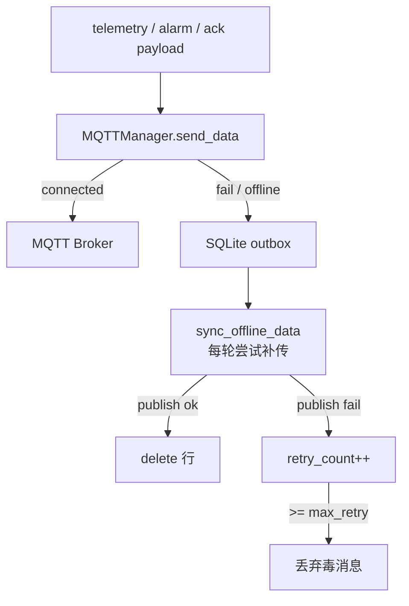

                               
     _ __ ___   __ _ ___  ___ ___  
    | '_ ` _ \ / _` / __|/ __/ _ \ 
    | | | | | | (_| \__ \ (_| (_) |
    |_| |_| |_|\__,_|___/\___\___/ 
                                   

# Embedded Linux RS485 + Modbus RTU + MQTT Edge Collector

适用于嵌入式 Linux 网关的模块化边缘采集程序。两路 RS485 并发采集，本地规则保护，MQTT 上报，断网缓存补传，并支持远程配置下发与 systemd watchdog。

## 架构

```text
main.py
 └── edge_collector/
      ├── service.py        主循环、热加载、生命周期
      ├── collector.py      两路 RS485 并发 + Modbus 批量读
      ├── modbus_port.py    串口连接、读写、重试
      ├── decode.py         数据类型与字节序
      ├── rules.py          阈值 / 通信故障 / 双重关断
      ├── gpio_control.py   libgpiod 关断输出
      ├── mqtt_manager.py   TLS、上报、配置订阅、离线补传
      ├── store.py          SQLite outbox
      ├── config.py         配置校验与原子写入
      └── watchdog.py       systemd READY / WATCHDOG
```

## 全流程关系图

### 和主流程的关系（简图）



### 启动与模块装配

```text
python3 main.py
  │
  ├─ setup_logging()
  └─ CollectorService("config.json")
        │
        ├─ Config 加载 / 校验 config.json
        └─ _build()
              ├─ SQLiteStore          ← database.path
              ├─ ModbusPort × N       ← serial_ports[]
              ├─ GpioController       ← gpio
              ├─ RuleEngine(ports, gpio) ← rules[]
              ├─ Collector(ports)     ← collect + serial_ports
              ├─ SystemdWatchdog      ← watchdog
              └─ MQTTManager.start()  ← mqtt（后台线程收消息）
                    │
                    └─ service.run() 进入主循环
```



### 主循环数据流（每轮一次）

中间产物在各模块间传递：

| 阶段 | 调用 | 输入 | 输出 / 中间数据 |
| --- | --- | --- | --- |
| ① 热更新 | `_maybe_apply_remote_config` | MQTT 队列中的 config payload | 可能 `_build` 重建运行时；ACK → `config_ack_topic` |
| ② 采集 | `Collector.collect_once` | `serial_ports` + `ModbusPort` | `data`（上报 JSON）、`values`（规则用）、`comm_status` |
| ③ 规则 | `RuleEngine.process` | `values` + `comm_status` | `events[]`；可选 GPIO / Modbus 写 |
| ④ 告警 | `_publish_alarms` | `events` | MQTT `alarm_topic`（失败则进 outbox） |
| ⑤ 上报 | `MQTTManager.send_data` | `data` JSON（按 `upload_interval`） | 成功直发；失败 → SQLite outbox |
| ⑥ 补传 | `sync_offline_data` | outbox 批次 | 成功删行；失败 `retry_count++` |
| ⑦ 自愈 | `_health_and_recover` | SQLite / MQTT / 串口健康 | 超阈值则 recover 对应模块 |
| ⑧ 喂狗 | `watchdog.ping` | — | systemd `WATCHDOG=1` |
| ⑨ 休眠 | `sleep` | `collect.interval - elapsed` | 下一轮 |



### 采集链路：寄存器 → 测点值

```text
Collector.collect_once()
  │  每路 RS485 提交到 ThreadPoolExecutor（多口并发）
  ▼
ModbusPort._collect_port / read_registers
  │  同口多从站串行；相邻寄存器按 batch_max_gap/count 批量读
  ▼
decode.decode_registers + scale_value
  │  字节序 / 数据类型 → raw → value * scale + offset
  ▼
三路结果汇总回主线程：
  ├─ values[source] = float/int
  │     source = "端口名:从站号:参数名"   ← 给规则引擎
  ├─ data = {
  │     device_id, timestamp, datetime,
  │     data: { source: {value, unit}, ... },
  │     comm: { source|device|port: "ok"|"fail" }
  │   }                                   ← 给 MQTT 上报
  └─ comm_status[source|device|port] = bool  ← 给规则 / 健康检查
```



### 规则与关断：测点 → 告警 / GPIO / Modbus

```text
RuleEngine.process(values, comm_status)
  │
  ├─ threshold：compare(values[source], op, threshold)
  ├─ comm_fail：comm_status[source] is False
  │
  ├─ 连续 matched >= consecutive 且未 triggered
  │     ├─ execute_action
  │     │     ├─ gpio / dual  → GpioController.set_line(line, value)
  │     │     └─ modbus_write / dual → ModbusPort.write_register(...)
  │     └─ 生成 event{name, type, source, value, severity, ...}
  │
  └─ 条件恢复 → 计数清零，允许再次触发

events → service._publish_alarms → MQTT alarm_topic
         （失败同样走 send_data → SQLite outbox）
```

### 上报与离线补传：payload → Broker / SQLite

```text
                    ┌── 已连接 ──► MQTT Broker（topic / alarm_topic / ack）
send_data(topic, payload)
                    └── 未连接 / 失败 ──► SQLiteStore.save
                                              │
sync_offline_data() ◄── 每轮只要 MQTT 可用就拉一批
  │  FIFO：get_batch → publish → delete
  │  失败：increase_retry；超过 max_retry 丢弃
  └─ 超过 max_records 删最旧行
```



### 远程配置热更新（旁路，插在主循环①）

```text
云端 / 运维
  │  publish → mqtt.config_topic
  ▼
MQTTManager.on_message ──► _config_queue（只入队，不重建）
  │
  ▼ 主循环 poll_config()
Config.apply_remote（replace / patch，写回 config.json）
  │
  ├─ DB path 未变 → 复用 SQLiteStore
  ├─ MQTT signature 未变 → 复用 MQTT 连接
  └─ 其余（ports / gpio / rules / collector）按新配置 _build
  │
  └─ publish_ack → config_ack_topic
```

### 异常与自愈关系

```text
主循环每步 try/except 隔离，单步失败不退出进程：

  采集失败 ──► recover_executor + _recover_rs485
  上报失败 ──► _recover_mqtt + _recover_sqlite
  健康检查 ──► 连续不健康达到 watchdog.*_restart_after
                 ├─ SQLite → store.recover / 重建
                 ├─ MQTT   → mqtt.restart（保留待处理配置队列）
                 └─ RS485  → 关旧口、建新 ModbusPort、回写 collector/rules

进程卡死 / 退出 ──► systemd WatchdogSec 拉起整个服务
Ctrl+C / stop() ──► watchdog.stopping + _close_runtime
```

## 功能

### 配置与启动

- 从 `config.json` 加载并校验运行参数
- 命令行：`python3 main.py`
- `Ctrl+C` 优雅退出
- systemd：`Type=notify`、开机自启、异常重启、watchdog
- `install.sh` 安装依赖并注册服务
- MQTT 热更新采集参数：完整替换或局部 patch，写入本地后热加载，无需 SSH
- 主循环按步骤隔离：RS485 / MQTT / SQLite 任一异常只恢复对应模块，并继续喂狗

### 多串口 / Modbus RTU 采集

- 两路（或多路）RS485 **并发采集**，同一总线内仍按从站串行
- 每路多从站、多参数
- 相邻 / 重叠寄存器 **自动合并批量读**（`batch_max_gap` / `batch_max_count`；线圈另有 `batch_max_gap_bits` / `batch_max_count_bits`）
- 例：测点 `0~10` 与 `11~20` 合并为一次读 21 个寄存器；空洞 ≤ gap 时也会桥接，受单帧 `max_count`（默认 125）限制
- 启动时预计算并日志输出：`N params → M requests`，避免每轮重复规划
- 读 Holding / Input Register；写 Holding Register
- 读失败按 `collect.retry` 重试；`request_timeout` 作为串口超时
- 连接失败自动重连；兼容 pymodbus `slave` / `device_id`

### 数据解析与换算

- `uint16` / `int16` / `uint32` / `int32` / `float32`
- 16 位字节序：`AB`、`BA`
- 32 位字节序：`ABCD`、`CDAB`、`BADC`、`DCBA`
- `scale` / `offset`：`value * scale + offset`
- 测点名：`端口名:从站号:参数名`

### 规则引擎与双重关断

- 阈值规则：`>` `>=` `<` `<=` `==` `!=`，连续 N 次触发
- 通信故障规则 `comm_fail`：端口 `RS485_1`、设备 `RS485_1:1` 或测点 `RS485_1:1:temperature` 连续 N 次读取失败
- 触发后发 MQTT 告警（`alarm_topic`），并可执行 `alarm` / `modbus_write` / `gpio` / `dual`
- 条件恢复后才允许再次触发

### GPIO 关断输出

GPIO **不是日常采集通道**，而是安全关断（safety shutdown）输出：规则命中后拉高/拉低某根脚，用于切断设备或驱动继电器。传感器仍走 RS485/Modbus；GPIO **只出不入**。

| 层级 | 作用 |
| --- | --- |
| `config.json` → `gpio` | 指定芯片路径（默认 `/dev/gpiochip0`）和 consumer 名 |
| `GpioController` | 用 Linux `libgpiod` 申请输出线并写电平 |
| `RuleEngine` | 阈值/通信故障满足后，按 `action.type` 决定是否写 GPIO |
| `CollectorService` | 创建 GPIO、交给规则引擎、退出时 `close()` |

**调用链**

```text
主循环 collect_once()
  → values / comm_status
  → RuleEngine.process()
      → 条件连续成立 N 次，且本轮尚未触发过
      → execute_action()
          → type 为 gpio / dual 时 → GpioController.set_line(line, value)
      → 同时生成 alarm 事件
  → MQTT 上报告警
```

对应服务里的步骤：采集后立刻跑规则并 _publish_alarms

**规则侧逻辑**

1. 条件判断：`threshold` 比较测点值；`comm_fail` 看对应 `comm_status` 是否失败
2. 防抖：条件成立则 `counters[name] += 1`；条件不成立则计数清零并清除 `triggered`，允许下次再触发
3. 真正关断只做一次：`counters >= consecutive` 且尚未 `triggered` 时置位并执行 action
4. `action.type` 决定执行范围：

| `action.type` | 行为 |
| --- | --- |
| `alarm` | 只告警，不写 GPIO/Modbus |
| `gpio` | 只写 GPIO |
| `modbus_write` | 只写寄存器 |
| `dual` | GPIO + Modbus 都做（高温/过流/通信失败常用） |

**配置示例**（高温连续 3 次 ≥ 80 → Modbus 关设备 + GPIO line 17 置 1 + 告警）：

```json
{
  "gpio": {
    "chip": "/dev/gpiochip0",
    "consumer": "edge-collector"
  },
  "rules": [
    {
      "name": "high_temperature_shutdown",
      "type": "threshold",
      "source": "RS485_1:1:temperature",
      "operator": ">=",
      "threshold": 80,
      "consecutive": 3,
      "action": {
        "type": "dual",
        "modbus": {
          "port": "RS485_1",
          "slave_id": 1,
          "register_type": "holding",
          "address": 100,
          "value": 0
        },
        "gpio": {
          "line": 17,
          "value": 1
        }
      }
    }
  ]
}
```

**`GpioController` 行为**

- `gpiod` 可选：非 Linux / 未安装时写脚失败并打日志，进程不退出
- 向 `chip` 申请指定 line 为 OUTPUT，初始 INACTIVE；换线会先释放再重新申请（当前一次只管一根线）
- `set_line(line, value)`：`value != 0` → ACTIVE，否则 INACTIVE；写成功打 `CRITICAL` 日志


和主流程的关系（简图）
flowchart TD
  A[采集 Modbus 测点] --> B[RuleEngine.process]
  B --> C{条件连续成立?}
  C -->|否| D[计数清零 / 可再次触发]
  C -->|是且未触发过| E[execute_action]
  E --> F{action.type}
  F -->|gpio / dual| G[GpioController.set_line]
  F -->|modbus_write / dual| H[Modbus 写寄存器]
  F -->|任意| I[生成 alarm 事件]
  I --> J[MQTT 发布告警]

使用注意
GPIO 是关断执行器，不是采集输入。
只在 Linux 目标板 + gpiod 可用时真正生效；开发机一般只会看到失败日志。
line / value 必须按硬件接线和电平极性核对，写错会直接驱动真实硬件。


### MQTT

- 用户名密码、断线重连、QoS 1
- 可选 TLS（CA / 客户端证书，`insecure` 可关校验）
- 采集周期与上报周期分离
- 上报 JSON 含测点值和 `comm` 通信状态
- 订阅 `config_topic` 接收配置，向 `config_ack_topic` 回执
- 规则触发时向 `alarm_topic` 上报告警

### 离线缓存与补传

- SQLite WAL outbox
- MQTT 不可用时入库，恢复后 FIFO 批量补传
- 超过 `max_retry` 丢弃毒消息，避免堵死队列
- 超过 `max_records` 删除最旧记录

### Watchdog 与模块自恢复

- 启动 `READY=1`，每轮结束 `WATCHDOG=1`，退出 `STOPPING=1`
- 采集、规则、上报、健康检查分步隔离，单模块异常不退出进程
- RS485 连续断开则重建串口客户端；MQTT 连续失联则重启客户端（保留待处理配置）；SQLite 出错则重开数据库
- 单路采集超时只标记该路失败并恢复该口，另一路继续
- systemd `WatchdogSec=30`：进程完全卡死时由 systemd 拉起

## 1. 安装依赖

```bash
pip3 install -r requirements.txt
```

## 2. 修改配置

编辑 `config.json`：

- 串口路径、波特率、从站、寄存器、数据类型、`byte_order`、scale
- MQTT 地址、账号、TLS 证书、数据 topic / 配置 topic
- 批量读窗口、采集/上报周期、读重试
- GPIO chip/line、阈值规则、通信故障规则

### 远程配置热更新

向 `mqtt.config_topic` 发布，无需 SSH 登录网关。结果回执在 `mqtt.config_ack_topic`。

局部修改采集参数：

```json
{"op": "patch", "collect": {"interval": 5, "upload_interval": 30}}
```

也可以直接发：

```json
{"collect": {"interval": 5}}
```

替换整份配置：

```json
{"op": "replace", "config": { }}
```

旧文件备份为 `config.json.bak`。

### 通信异常告警

`type=comm_fail` 的 `source` 可以是端口、从站或测点。连续失败后发到 `alarm_topic`：

```json
{"device_id":"EDGE_001","name":"rs485_1_comm_fail","type":"comm_fail","source":"RS485_1:1","consecutive":5,"severity":"critical","code":"COMM_FAIL"}
```

`action.type=alarm` 只告警；`dual` 则告警并执行 GPIO/Modbus 关断。

### 字节序

| 配置 | 含义 |
| --- | --- |
| `AB` | 16 位大端 |
| `BA` | 16 位字节交换 |
| `ABCD` | 32 位大端 |
| `CDAB` | word swap |
| `BADC` | byte swap |
| `DCBA` | 32 位小端 |

## 3. 运行

```bash
python3 main.py
```

## 4. systemd

将项目放到 `/opt/edge_collector` 后：

```bash
cp edge-collector.service /etc/systemd/system/
systemctl daemon-reload
systemctl enable edge-collector
systemctl start edge-collector
```

查看：

```bash
systemctl status edge-collector
journalctl -u edge-collector -f
```

## 注意

1. 寄存器地址是 Modbus PDU 地址。手册若写 40001/30001，需确认是否要减 1。
2. 关断规则会写真实 GPIO 和 Modbus 寄存器，必须按设备协议核对 line、地址和值。
3. MQTT 不可用时数据进入 SQLite outbox，恢复后 FIFO 补传。
4. `gpiod` 仅在 Linux 目标板上生效；Windows 开发机上 GPIO 动作会记录失败日志。
5. 启用 MQTT TLS 时，把 `mqtt.tls.enable` 设为 `true`，并配置 CA/证书路径。
6. `Type=notify` 依赖 systemd `NOTIFY_SOCKET`；直接 `python3 main.py` 时 watchdog 通知会被忽略。
7. 模块自恢复不能替代 systemd：只有进程彻底卡死/退出时才由 `WatchdogSec` 拉起整个服务。
